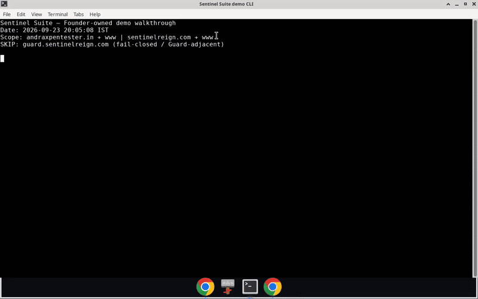
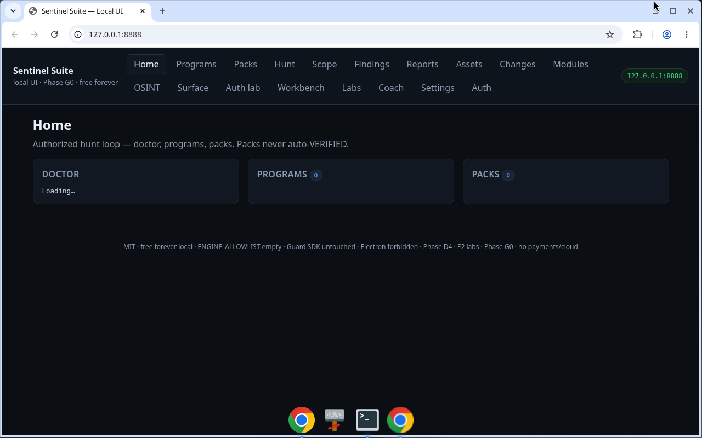
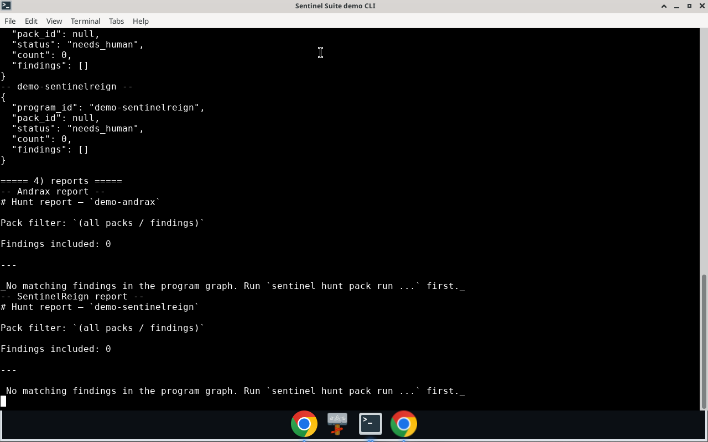

# Sentinel Suite

**Authorized attack-surface OSINT (ShadowsEye) + hunt packs that prove (Gungnir) + a local UI — no account, no card, no calling home.**

Map in-scope hosts, watch diffs, run official hunt packs, coach through labs, confirm findings yourself, and export reports. Everything stays on your machine under `~/.sentinel`.

[](LICENSE)
[](pyproject.toml)
[](#ethics--scope)
[](docs/FREE_PROMISE.md)
[](docs/FREE_PROMISE.md)

Monorepo: [cyb3rvolt3x-A4lixhaS3ntin3l/sentinel-suite](https://github.com/cyb3rvolt3x-A4lixhaS3ntin3l/sentinel-suite)

> **Authorized targets only.** Bug bounty, pentest, or assets you own with written permission. The suite never includes Guard SDK / `sentinelagent-guard`.

## See it run

12-second preview (derived from the real 95s walkthrough — Founder-owned hosts only):



**Full walkthrough** (95s, 589 KB): [`docs/assets/demos/demo_walkthrough.mp4`](docs/assets/demos/demo_walkthrough.mp4)

GitHub READMEs do not always autoplay MP4. Use the GIF above, the stills below, or open the file / [Release](https://github.com/cyb3rvolt3x-A4lixhaS3ntin3l/sentinel-suite/releases/tag/v0.1.0-productization).

| Local UI (`http://127.0.0.1:8888`) | CLI report (honest **0** findings) |
| --- | --- |
| [](docs/assets/demos/ui_home.png) | [](docs/assets/demos/cli_walkthrough.png) |

Stills are uncropped from the same authorized run. Scope was `andraxpentester.in` + `sentinelreign.com` only (`guard.*` skipped). Official packs emitted **0** findings — zeros are real (fixture-first packs; live `127.0.0.1` mocks were out of scope).

## Install (above the fold)

PyPI is **not** published. Do not `pip install sentinel-suite` from the index.

```bash
git clone https://github.com/cyb3rvolt3x-A4lixhaS3ntin3l/sentinel-suite.git
cd sentinel-suite
python3 -m venv .venv && source .venv/bin/activate   # Windows: .venv\Scripts\activate
pip install -U pip
pip install -e packages/sentinel_core \
            -e packages/shadowseye \
            -e packages/gungnir \
            -e packages/sentinel_cli \
            -e packages/sentinel_suite
sentinel doctor
sentinel ui --open
# → http://127.0.0.1:8888
```

Or Docker Compose (clean-room UI + engine):

```bash
docker compose up --build
# → http://127.0.0.1:8888
```

Full platform matrix, unsigned Linux CLI checksum, WSL2: [`docs/INSTALL.md`](docs/INSTALL.md) · [`docs/WSL2.md`](docs/WSL2.md)

## Features

| Capability | What you get |
| --- | --- |
| **Local-first** | Single-operator suite. Data under `~/.sentinel`. Loopback UI default. |
| **No account / no card** | Free forever for the local path. See [`docs/FREE_PROMISE.md`](docs/FREE_PROMISE.md). |
| **No calling home** | Telemetry **OFF** unless you set `SENTINEL_TELEMETRY=1` (local JSONL stub; still no remote sink). |
| **Scope gate** | HTTP is hard-killed unless the host is in `--scope` **or** you pass `--i-own-this` (lab override). |
| **ShadowsEye (watch)** | DNS / ports / HTTP / tech diffs on a per-program event graph. `--no-tools` is the default (engine allowlist is empty). |
| **Gungnir (hunt)** | **12** official packs. Findings stay `needs_human` / `unverified` until you `confirm-finding`. |
| **CLI + UI** | `sentinel` on the terminal; browser UI at `http://127.0.0.1:8888`. `sentinel ui --open` opens the default browser. |
| **Labs** | Juice Shop, crAPI, auth-session — coach does **not** invent findings. |
| **Zip export** | `sentinel program export` → offline zip under `~/.sentinel/exports/`. |
| **Desktop shell** | Optional Tauri scaffold wraps the same loopback URL. **No** shipped `.dmg` / `.msi` / `.AppImage`. |

## How it compares (capability shape — no fake metrics)

Not a Burp replacement. Shape only: where the suite sits vs common neighbors. **No** invented stars, downloads, CVE counts, or “faster/better” scores.

| | **Sentinel Suite** | **Burp Suite** | **OWASP ZAP** | **Caido** | **Nuclei-class** |
| --- | --- | --- | --- | --- | --- |
| Local-first (no vendor cloud required) | Yes | Desktop app | Desktop app | Desktop; optional cloud | CLI binary |
| Hard scope gate before HTTP | Yes — kernel hard-kill | Project / suite scope | Context / scope | Project scope | Operator + templates |
| Account required for core | **No** | No (Community) / license (Pro) | No | No for core desktop | No |
| UI | Local browser UI `127.0.0.1:8888` | Native desktop | Native desktop | Native desktop + CLI | CLI (no suite UI) |
| Attack-surface OSINT / watch | ShadowsEye | Not OSINT-first | Not OSINT-first | Not OSINT-first | Companion tools, not this binary |
| Proof / hunt | 12 official packs; human confirm | Scanner + extensions | Scan rules / add-ons | Workflows | Template corpus |
| License | MIT | Proprietary | Apache-2.0 | Proprietary | MIT (Nuclei) |
| Signed / notarized installers | **Not claimed** | Vendor-signed | Often unsigned (documented) | Vendor builds | Release binaries |

## Install by platform

Primary path on every OS is **git + venv + pip -e** or **Docker Compose**. Binaries are optional convenience.

| Platform | What to use | Honesty |
| --- | --- | --- |
| **Linux** | Path/git (above) **or** Compose | Optional **UNSIGNED** CLI binary on the Release — verify SHA256 |
| **Windows** | **WSL2** recommended ([`docs/WSL2.md`](docs/WSL2.md)) + path/git or Compose | Native `.exe` is **script-only** (`scripts/build_pyinstaller_windows.ps1`). No verified exe on the Release. SmartScreen expected if you build one. |
| **macOS** | Path/git or Compose | **No** `.dmg` / `.app`. No notarization. Gatekeeper would apply if someone built an unsigned bundle — we do not ship one. |
| **Docker** | `docker compose up --build` | Host mapping `127.0.0.1:8888`. UI `--no-open` inside the container. |

### Optional UNSIGNED Linux CLI

Release (prerelease): [v0.1.0-productization](https://github.com/cyb3rvolt3x-A4lixhaS3ntin3l/sentinel-suite/releases/tag/v0.1.0-productization)

| Asset | SHA256 |
| --- | --- |
| `sentinel-linux-x86_64` | `004917159410226b4b88488f98142971c2679246e558d1e2111f826f167c9024` |
| `SHA256SUMS` + source tarball | attached on the same Release |

```bash
curl -L -O https://github.com/cyb3rvolt3x-A4lixhaS3ntin3l/sentinel-suite/releases/download/v0.1.0-productization/sentinel-linux-x86_64
curl -L -O https://github.com/cyb3rvolt3x-A4lixhaS3ntin3l/sentinel-suite/releases/download/v0.1.0-productization/SHA256SUMS
sha256sum -c SHA256SUMS --ignore-missing
chmod +x sentinel-linux-x86_64
./sentinel-linux-x86_64 doctor
./sentinel-linux-x86_64 ui --open
```

This binary is **UNSIGNED** (no Authenticode, no Linux vendor signature). Treat it like any unsigned security-tool download: verify the checksum, then decide. Antivirus / SmartScreen-class warnings are expected for this class of software.

**Not shipped:** PyPI wheels · Windows exe · macOS dmg · Linux AppImage · notarized / signed installers.

## CLI + UI

```bash
sentinel doctor                         # core health; missing Nmap/keys/WSL degrade only
sentinel demo                           # doctor → optional lab → UI (does not scan random hosts)
sentinel demo --lab juice-shop --no-open
sentinel ui --open                      # http://127.0.0.1:8888
sentinel ui --no-open                   # CI / Docker / headless

# Scope-gated full path (refuses to start without --target and --scope / --i-own-this)
sentinel full-run --program myprog --target example.com \
  --scope ~/.sentinel/programs/myprog/scope.txt
# optional: --pack open_redirect --url https://example.com/ --ui
```

Typical authorized loop:

```bash
sentinel program init demo
sentinel program import-brief demo ./brief.txt --platform auto
sentinel eye run demo example.com --scope ./scope.txt --no-tools
# or lab override:  sentinel eye run demo example.com --i-own-this --no-ports
sentinel hunt pack list
sentinel hunt pack run open_redirect --program demo --i-own-this \
  --url 'https://lab.example/'
sentinel hunt confirm-finding demo <finding-id> --status confirmed --note 'lab review'
sentinel hunt report demo --pack open_redirect -o ./report.md
sentinel program export demo
sentinel telemetry status               # OFF by default
```

`eye` / `hunt` require `--scope FILE` **or** `--i-own-this`. Packs never auto-confirm. Lab-gated packs (`race_toctou`, `http_desync` beyond fixtures, `ssrf_collaborator` beyond the local mock) also need `--i-understand-lab`. Deep pack recipes: [`docs/HUNTER_WORKFLOW.md`](docs/HUNTER_WORKFLOW.md).

Labs (optional):

```bash
sentinel lab list
sentinel lab open juice-shop --program lab-juice-shop
# docker run --rm -d --name juice-shop -p 127.0.0.1:3000:3000 bkimminich/juice-shop
sentinel lab tutorial lab-juice-shop
sentinel lab report lab-juice-shop -o ./report.md
```

Brand CLIs after the editable install: `shadowseye version` · `gungnir packs` · `sentinel`.

## Proof from authorized demos

Recorded 2026-09-23 against **Founder-owned** hosts only. Transcripts, Eye JSON, zip exports, and reports live in [`docs/assets/demos/`](docs/assets/demos/).

| Program | Hosts | Eye events | DNS names | HTTP rows | Tech | Findings |
| --- | --- | ---: | ---: | ---: | ---: | ---: |
| `demo-andrax` | andraxpentester.in + www | 15 | 2 | 4 | 0 | **0** |
| `demo-sentinelreign` | sentinelreign.com + www | 17 | 4 | 4 | 1 (cloudflare heuristic) | **0** |

`guard.sentinelreign.com` was **skipped** (fail-closed / Guard-adjacent). No client sites. No invented CVEs.

Zeros are honest: official packs are fixture-first; live localhost mocks were out of scope under `--scope`. Coach hints are not findings.

## Ethics & scope

- **Authorized use only** — bug bounty / pentest / your own assets with written permission
- **No malware, no destructive exploit PoCs, no other-customer harm**
- **Guard SDK / `sentinelagent-guard` never touched** and never bundled
- **No stalking defaults** (username/email extras stay opt-in, later)
- Secrets stay `SECRET_CANDIDATE` until a human (or Gungnir evidence) proves in-scope use
- Engine allowlist is **empty** — we do not download third-party scanners until hashes are pinned ([`docs/ENGINES.md`](docs/ENGINES.md))
- Docs do not invent stars, users, downloads, or CVEs

### Free forever (local)

A solo authorized hunter can map scope, watch, run official packs, use coach/labs, confirm findings, and export reports **without an account, without a credit card, and without calling home.**

| Layer | Free forever (local) | Paid later (additive — not started) |
| --- | --- | --- |
| Install & runtime | Path/git / Compose / unsigned Linux CLI | Cloud watch workers; managed collaborator |
| Modules | Official `stable` packs (+ labeled community channels) | Marketplace + certified packs |
| Data | `~/.sentinel/programs/` + zip export | Encrypted sync / team vaults |
| Collaboration | Single operator (loopback) | Team claims / seats |
| Identity | No SSO; bind `127.0.0.1` | SSO for org seats |
| Trust | MIT | SLA / support tiers |
| Sister products | — | Guard SaaS stays **separate** |

Checklist + telemetry: [`docs/FREE_PROMISE.md`](docs/FREE_PROMISE.md)

## Packages, mirrors, Release

| Link | What it is |
| --- | --- |
| This monorepo | Source of truth for the suite |
| [Release v0.1.0-productization](https://github.com/cyb3rvolt3x-A4lixhaS3ntin3l/sentinel-suite/releases/tag/v0.1.0-productization) | Prerelease: UNSIGNED Linux CLI + `SHA256SUMS` + src tarball |
| `packages/shadowseye` · `packages/gungnir` · `packages/sentinel_cli` · `packages/sentinel_core` · `packages/sentinel_suite` | Editable wheels (PyPI **not** published) |
| Public `ShadowsEye` / `gungnir` repos | Thin README mirrors → this monorepo |
| [`docs/INSTALL.md`](docs/INSTALL.md) | Path/git, Compose, binaries, webopen |
| [`docs/PRODUCTIZATION_PACKAGING.md`](docs/PRODUCTIZATION_PACKAGING.md) | Packaging honesty |
| [`docs/PRODUCTIZATION_DEMOS.md`](docs/PRODUCTIZATION_DEMOS.md) | Demo evidence pointer |

## Architecture

- **ShadowsEye (Eye)** — watches attack surface; feeds the per-program graph
- **Gungnir (Hunt)** — proves with packs + evidence; does not remap unless asked
- **`sentinel_core`** — event schema v1, SQLite WAL under `SENTINEL_HOME` (default `~/.sentinel`), scope kernel (OOS = hard kill), engine pin under `~/.sentinel/bin/`
- Thin **bridges** are not ports of any live ShadowsEye/Gungnir marketing CLI
- **workers/** reserved for future Go/Rust hot-path bins
- **Guard SDK** — separate product; **never** in this tree

## Disclaimer

Use only on systems you are authorized to test. The optional Linux CLI attached to the Release is **UNSIGNED**. Windows SmartScreen and macOS Gatekeeper will warn on unsigned binaries — we do not ship a Windows exe or a macOS dmg today; if you build them from the scripts, expect those warnings. No notarization or Authenticode is claimed.

## License

**MIT** — see [`LICENSE`](LICENSE). Founder preference Apache-2.0 is noted in [`docs/LICENSE_NOTE.md`](docs/LICENSE_NOTE.md); this tree stays MIT for consistency with the live ShadowsEye / Gungnir packages.

## Docs

| Doc | Purpose |
| --- | --- |
| [`docs/INSTALL.md`](docs/INSTALL.md) | Install truth (all platforms) |
| [`docs/WSL2.md`](docs/WSL2.md) | Windows + WSL2 engine path |
| [`docs/FREE_PROMISE.md`](docs/FREE_PROMISE.md) | Free forever vs paid later + telemetry |
| [`docs/HUNTER_WORKFLOW.md`](docs/HUNTER_WORKFLOW.md) | Map → pack → confirm → report |
| [`docs/ENGINES.md`](docs/ENGINES.md) | Allowlist vs deferred engines |
| [`docs/HUMAN-QUEUE.md`](docs/HUMAN-QUEUE.md) | OAuth / PyPI / hashes / counsel |
| [`docs/assets/demos/`](docs/assets/demos/) | Real demo video, stills, 0-finding reports |
| [`docs/PRODUCTIZATION_README.md`](docs/PRODUCTIZATION_README.md) | This README rewrite — ship pointer |

Productization is complete. Historical build-phase notes stay in `docs/PHASE_*` and `docs/SPRINT0*` for maintainers — they are not the current product story.

## Layout

```text
packages/sentinel_core   # schema, graph, scope, engines
packages/shadowseye      # Eye bridge + thin runner
packages/gungnir         # Hunt bridge + thin runner + 12 packs
packages/sentinel_cli    # sentinel → doctor, program, eye, hunt, ui, lab, demo, full-run
packages/sentinel_suite  # meta brand wheel → sentinel
docker/ + docker-compose.yml
docs/                    # install, ethics, hunter loop, historical PHASE_*
scripts/                 # packaging dry-run + platform build stubs
tests/
```
